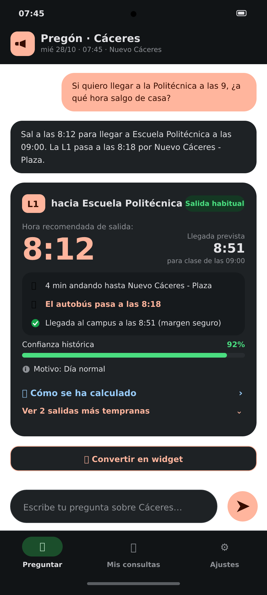
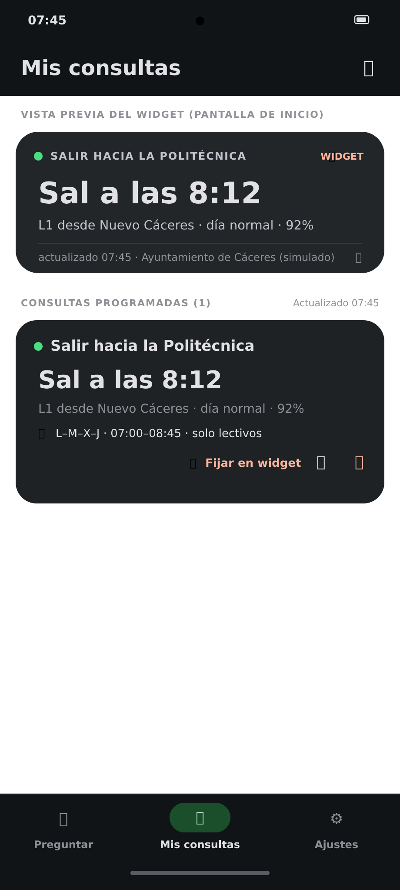
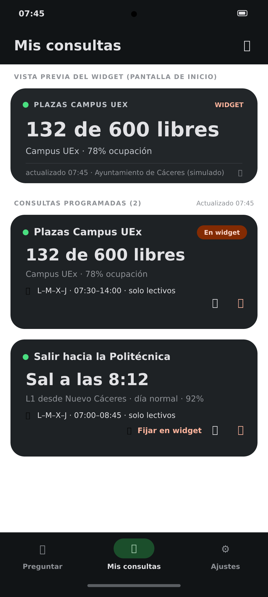

# Pregón · Asistente Urbano de Cáceres

> **Prueba de Hard Skills · Líderes Digitales Universitarios 2026**  
> Prototipo funcional completo con comportamiento simulado determinista, sin backend externo, sin APIs de terceros y sin LLM.

---

## 📱 Capturas de la Aplicación

| 1. Preguntar & Estimador de Salida | 2. Mis Consultas (Widget Salida) | 3. Mis Consultas (Widget Campus UEx) |
| :---: | :---: | :---: |
|  |  |  |
| *Cálculo de salida a la Escuela Politécnica (Sal a las 8:12) con desglose y confianza.* | *Consulta persistente en Room con previsualización del widget en tiempo real.* | *Actualización interactiva del widget para control de plazas libres en Campus UEx.* |

---

## 🏛️ Prototipo Funcional de la App

### ¿Qué está simulado?
1. **Reloj de la ciudad**:
   - El reloj no depende de la hora del sistema ni de zonas horarias variables; se modela como `{ date: 'YYYY-MM-DD', minutes: number }` (minutos desde medianoche, hora de Madrid).
   - Estado inicial: **miércoles 28/10/2026, 07:45**, modo **congelado** (*frozen*), sin incidencias activas.
2. **Red de transporte urbano (Cáceres)**:
   - Paradas `S01` a `S20` geolocalizadas con cálculo de caminata desde *"Mi casa"*.
   - Líneas `L1`, `L2`, `L3` y `L4` con frecuencias, cabeceras y *offsets* temporales por parada.
3. **Escenarios e Incidencias en tiempo real**:
   - `missing_bus` (Línea L1): suprime la expedición de las 08:15 y alerta de ocupación al 95% en la siguiente.
   - `rain`: factor de retención +5 min en ruta y +2 min extra de colchón para ir andando.
   - `accident_ronda_norte`: retención de +8 min en paradas de acceso al campus universitario (`S15` en adelante).
   - `exam_day`: aumento de ocupación en campus y saturación de aparcamiento.
4. **Servicios de la ciudad**:
   - **Farmacias de guardia**: rotación 24h por día del año entre farmacias reales de Cáceres y cálculo de distancia a pie.
   - **Aparcamientos**: aforo en tiempo real de Campus UEx (600 plazas), Obispo Galarza, Plaza de América y Estación.
   - **Meteorología**: climatología de Cáceres con previsión por franjas y recomendación de paraguas.
   - **Calendario UEx**: determinación estricta de días lectivos, festivos (ej. 2 de noviembre) y periodos no lectivos.
5. **Intérprete semántico determinista (sin LLM)**:
   - Analizador sintáctico por reglas deterministas con semilla (`SEED = 2026`).
   - Generación de `ThinkingSteps` animados para reflejar la latencia y auditoría de la consulta.
   - Desglose `"Cómo se ha calculado"` con traza JSON, tiempos de consulta por dataset y fórmula matemática visible.

### ¿Cómo se pasa al backend real?
En la pestaña **Ajustes > Fuente de datos**, la aplicación cuenta con un conmutador:
- **Simulada (sin backend)**: ejecuta el motor local puro en el dispositivo.
- **Backend real**: activa el cliente HTTP hacia la URL del servidor REST (`PLAN.md §2.5`).

---

## 🎬 Guion de Demostración Paso a Paso (Evaluación)

1. **Estado Inicial**:
   - Abre la app. En **Ajustes**, comprueba que *"Mi casa"* está en **Nuevo Cáceres** y el reloj marca **mié 28/10 07:45 · congelado**, sin escenarios.
2. **Consulta de salida a clase**:
   - En la pestaña **Preguntar**, pulsa la sugerencia:  
     *"Si quiero llegar a la Politécnica a las 9, ¿a qué hora salgo de casa?"*
   - Observa la animación de pasos (*Entendiendo la pregunta…*, *Buscando parada S19…*, *Consultando flota…*).
   - Resultado exacto: **`Sal a las 8:12`** (L1 08:15 pasa a las 8:18 por S02, llega a las 8:51, 92% confianza, motivo *Día normal*).
   - Pulsa **"Cómo se ha calculado"** para ver la traza determinista y la fórmula:  
     `8:18 − 4 min andando − 2 min colchón = 8:12`.
   - Revisa las **Fuentes oficiales** citadas (Ayuntamiento de Cáceres, sensores de afluencia, CC0).
3. **Convertir en Widget (Consulta persistente)**:
   - Pulsa **"Convertir en widget"**.
   - Se abre el modal con días L–J, ventana 7:00–8:45 y *"Solo días lectivos"*.
   - Guarda la consulta. En la pestaña **Mis consultas**, el widget muestra **`Sal a las 8:12`**.
4. **Inyección de Incidencia (Autobús suprimido)**:
   - Ve a **Ajustes** y activa el escenario **"Falta un autobús (L1 08:15 suprimido)"**.
   - Vuelve a **Mis consultas** y pulsa el widget o el botón *Recalcular*:
   - El resultado cambia de inmediato a **`Sal a las 7:57`** (*15 min antes de lo habitual · la L1 va con un autobús menos*).
5. **Simular Mañana**:
   - En **Ajustes**, pulsa **"Simular mañana"**.
   - El reloj salta automáticamente al **jue 29/10 07:30**, elimina las incidencias y reevalúa las consultas.
   - El widget vuelve a **`Sal a las 8:12`** (*Día normal*), registrando en su traza que se ejecutó **sin LLM**.
6. **Filtro de Días Programados y Festivos**:
   - Si adelantas el reloj al sábado o al festivo del 2 de noviembre, el widget marca automáticamente:  
     **`Hoy no te toca`** o **`Hoy no hay clase`**.
7. **Otras Consultas de la Ciudad**:
   - *"¿Qué farmacia está de guardia hoy?"* → Muestra la tarjeta con Farmacia Cánovas (24h) y distancia a pie.
   - *"¿Hay sitio en el parking del campus?"* → Medidor de ocupación de las 600 plazas del Campus UEx.
   - *"¿Hay clase mañana?"* → Verificación con el calendario oficial UEx.
8. **Respuesta Fuera de Dominio**:
   - Pregunta *"¿Quién ganó el Mundial?"* → Pregón responde con transparencia indicando sus capacidades y ofreciendo sugerencias relevantes.

---

## 🛠️ Tecnologías y Arquitectura

- **Plataforma**: Android Nativo (Kotlin 2.0+).
- **UI & Diseño**: Jetpack Compose con **Material Design 3 (M3)**, tema urbano Cáceres (terracota, piedra y verde encina), safe area insets y etiquetas de accesibilidad `testTag`.
- **Persistencia**: **Room Database** con consultas reactivas (`Flow`) para las consultas persistentes y el widget.
- **Patrón de Arquitectura**: MVVM (`MainViewModel` + `StateFlow`).
- **Verificación**: Batería de pruebas unitarias automáticas con **JUnit 4** y **Robolectric**, verificando el 100% de la tabla de referencia dorada.
